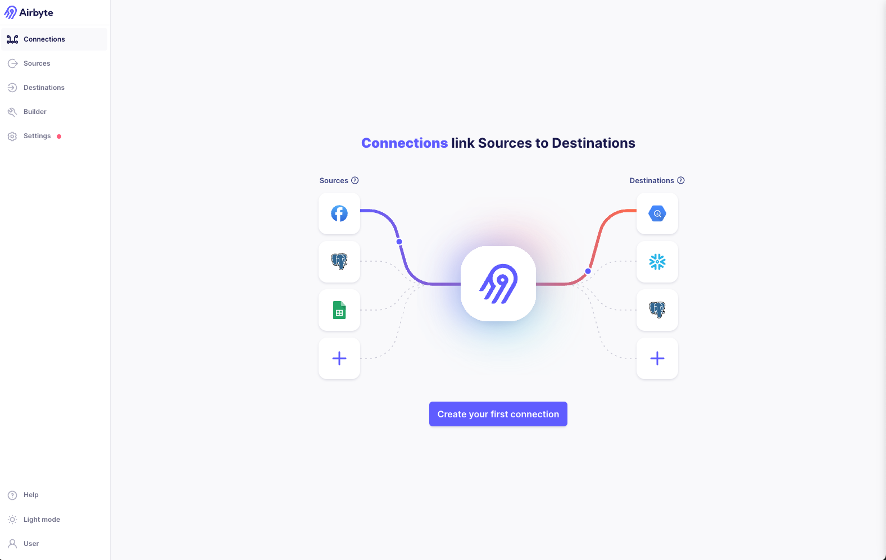

# Airbyte: Data Ingestion in Vero

[Airbyte](https://airbyte.com) is used in Vero as the **data ingestion layer**, pulling data from external sources (APIs, databases, flat files, etc.) into the central PostgreSQL warehouse. It allows organizations to automate, normalize, and schedule syncs with minimal setup — all open source.

## Why Airbyte Is Separate

Airbyte is **not included in the default Vero Docker Compose file** for a few reasons:

- It has its own ecosystem and setup process
- It manages many long-running connectors and resources
- Keeping it in a separate network avoids port conflicts and simplifies scaling

Instead, Airbyte runs in its own container stack and network, as documented by the official OSS install guide.

📘 Official setup instructions:
🔗 [Airbyte OSS Quickstart](https://docs.airbyte.com/platform/using-airbyte/getting-started/oss-quickstart)

## Networking & Connectivity

Airbyte runs **in a separate Docker network** from Vero. This means you need to connect using **host-based access**, not by Docker service name.

### Hostname for Vero PostgreSQL

| OS      | Hostname to Use                                          |
| ------- | -------------------------------------------------------- |
| macOS   | `host.docker.internal`                                   |
| Linux   | `172.17.0.1` (default Docker bridge IP) or your local IP |
| Windows | `host.docker.internal`                                   |

## Connecting to Vero’s PostgreSQL

When setting up a **destination** in Airbyte, choose:

- **Destination type**: PostgreSQL
- **Host**: `host.docker.internal` (macOS/Windows) or `172.17.0.1` (Linux)
- **Port**: `5432`
- **Database**: `demodb`
- **Username**: `username`
- **Password**: `Nearness4PrincessNext`
- **SSL**: Disabled (for local dev)

> ⚠️ This connects Airbyte’s containers to Vero’s warehouse container via the host bridge. In production, use secured networking (e.g., VPN, TLS, firewall rules).
