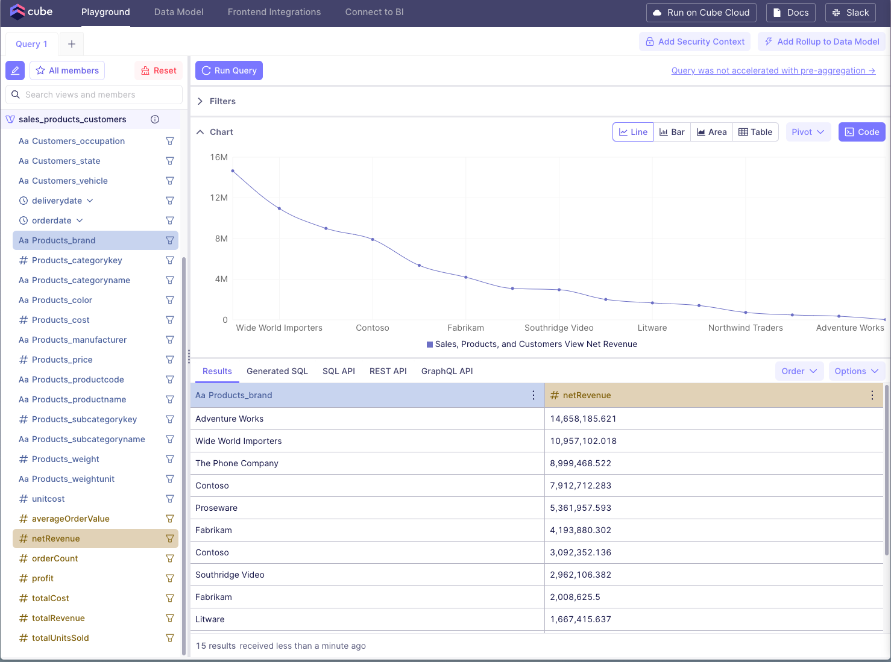

# Cube.js: Semantic Modeling in Vero



Cube.js serves as the **central semantic layer** in the Vero architecture. It provides a unified and consistent way to define business logic (metrics, dimensions, KPIs), exposes that logic via APIs, and ensures reusability across AI agents, dashboards, and external applications.

> 🔗 [Cube.js GitHub](https://github.com/cube-js/cube)
> 🔗 [Cube.js Documentation](https://cube.dev/docs)

## Role of Cube.js in Vero

Cube.js acts as a:

- **Central access layer** to define and expose reusable, governed metrics
- **Query engine** for analytical queries via REST, SQL, and GraphQL
- **Scalable backend** with support for pre-aggregations, caching, and multi-datasource access
- **AI grounding layer**, powering the MCP Server with metadata-aware, structured query generation

By centralizing business logic here, we ensure:

- Consistency across systems (BI, APIs, AI)
- Scalability via pre-aggregations
- Separation of concerns between logic and presentation

## ⚙️ Required Configuration

Cube.js requires environment variables to connect to the data warehouse and optionally expose a SQL API for BI tools like Metabase.

### PostgreSQL Warehouse Configuration (in `cubejs/.env.dev` or `.env.example`)

```env
# Database connection details (PostgreSQL example)
CUBEJS_DB_HOST=postgres                 # Hostname or Docker service within the Docker Vero Network
CUBEJS_DB_PORT=5432                     # Postgres default port
CUBEJS_DB_NAME=demodb                   # Demo database
CUBEJS_DB_USER=username                 # Development DB username
CUBEJS_DB_PASS=Nearness4PrincessNext    # Development DB password
```

### SQL API Configuration (in Vero root `.env.dev` or `.env.example`)

```env
# Optional: SQL-over-Postgres API port (for BI tools like Superset, Metabase)
CUBEJS_PG_SQL_PORT=15432                # Port for SQL API access

# SQL API credentials (not related to the main DB connection)
CUBEJS_SQL_USER=user                    # Username for Cube SQL API
CUBEJS_SQL_PASSWORD=password            # Password for Cube SQL API

# API secret for signing JWTs and securing requests
# ⚠️ Replace with a strong random string in production
CUBEJS_API_SECRET=dev-secret-abc1234567890xyzXYZ
```

These configurations are required to run Cube.js properly inside Docker and connect to your BI tools.

## Folder Structure

```bash
cubejs/
├── model/           # Core cube definitions (data models)
├── views/           # Semantic, curated layer for business users
├── .env.dev         # DB connection and config
├── Dockerfile       # Custom image extensions (e.g., curl)
```

## Default Schema Models

The default demo includes semantic models for:

- `Customers`
- `Dates`
- `Products`
- `Sales`
- `Stores`

And one default **semantic view**:

- `SalesView`

All default cubes are defined with `public: false` to keep raw logic **shielded from direct user access**. This allows you to control visibility through semantic views.

## Cube.js Schema Example

```js
// cubejs/model/Sales.js
cube(`Sales`, {
  sql: `SELECT * FROM sales`,

  public: false, // hide raw cube from end users

  measures: {
    totalRevenue: {
      type: "sum",
      sql: "amount",
    },
    count: {
      type: "count",
    },
  },

  dimensions: {
    id: {
      type: "number",
      sql: "id",
      primaryKey: true,
    },
    createdAt: {
      type: "time",
      sql: "created_at",
    },
  },
});
```

> Cube.js uses **YAML or JavaScript** for schema definitions. For simple models or configuration-first use cases, YAML is sufficient. In Vero, we use **JavaScript** to support **dynamic, programmatic logic**, conditional expressions, and calculated fields — making models flexible and powerful.

## Views vs Models: Key Differences

### Model Files (Cubes)

- **Purpose**: Map to database tables or SQL queries
- **Content**: Measures, dimensions, joins, pre-aggregations
- **Role**: Represent raw data structure and business logic
- **Visibility**: Typically hidden (`public: false`) to prevent direct exposure

### View Files

- **Purpose**: Provide a semantic layer curated for business users and BI tools
- **Content**: Reference cube elements, control visibility, rename or group fields
- **Role**: Act as a **facade or public API** for your data
- **Visibility**: Meant to be exposed (`public: true`), replacing direct access to cubes

> Use views to **govern what is exposed**, while keeping raw cubes flexible and protected.

### What You _Can_ Do in a View

- Expose fields from multiple cubes via `join_path`
- Rename or alias fields for clarity
- Organize fields into folders for better UI structure
- Extend other views to inherit definitions
- Apply access control policies to restrict fields or views

### What You _Can't_ Do in a View

- Define new SQL joins (must be in cubes)
- Create new SQL `GROUP BY` logic
- Add new measures or dimensions

#### Example View Definition

```yaml
views:
  - name: orders
    cubes:
      - join_path: base_orders
        includes:
          - status
          - created_date
          - total_amount
      - join_path: base_orders.line_items.products
        includes:
          - name: name
            alias: product
      - join_path: base_orders.users
        prefix: true
        includes: "*"
        excludes:
          - company
    folders:
      - name: Basic Details
        includes:
          - created_at
          - location
```

> **Summary**: Views reference and organize fields — **not logic**. For logic, update the cube models first.

## Datasource Configuration

By default, the demo setup uses `dataSource: "default"`. However, Cube.js supports multiple datasources using `.env` configuration.

To define a new datasource:

```env
# .env.example
CUBEJS_DATASOURCES__<NAME>__DB_TYPE=mysql
CUBEJS_DATASOURCES__<NAME>__DB_HOST=crm-db-host
CUBEJS_DATASOURCES__<NAME>__DB_NAME=crm
CUBEJS_DATASOURCES__<NAME>__DB_USER=crm_user
CUBEJS_DATASOURCES__<NAME>__DB_PASS=crm_pass
```

And in your model:

```js
cube(`CRM_Accounts`, {
  sql: `SELECT * FROM accounts`,
  dataSource: "crm",
});
```

## Using the Cube.js Playground

- Open [`http://localhost:4000`](http://localhost:4000/)
- Browse cubes and views
- Preview queries, inspect generated SQL

## Best Practices

- Keep cubes private and use views to expose only what’s needed
- Use views to simplify and organize the UI for business users
- Group related metrics and dimensions into folders
- Apply naming conventions that match business language
- Leverage Cube’s JS syntax for reusable logic and conditions

Need more? Dive into the [official Cube.js docs](https://cube.dev/docs) or explore the [GitHub repo](https://github.com/cube-js/cube) for examples and community support.
